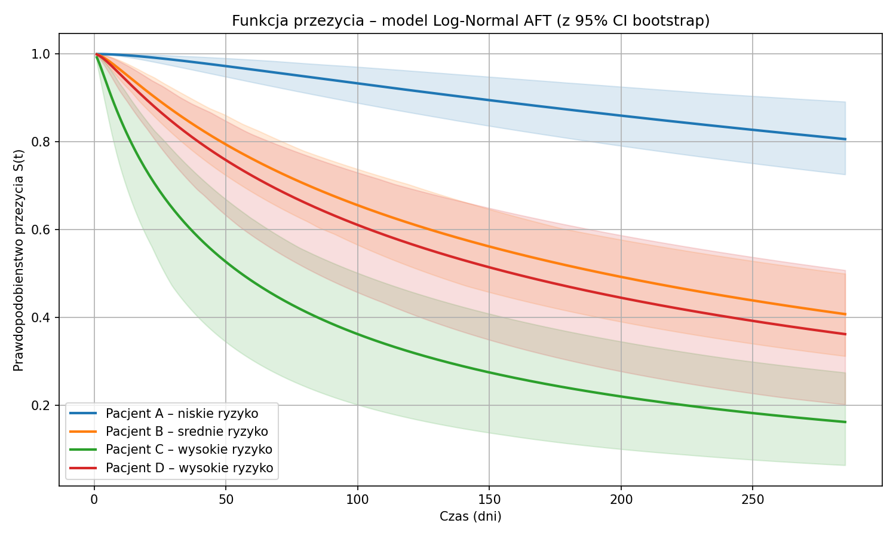
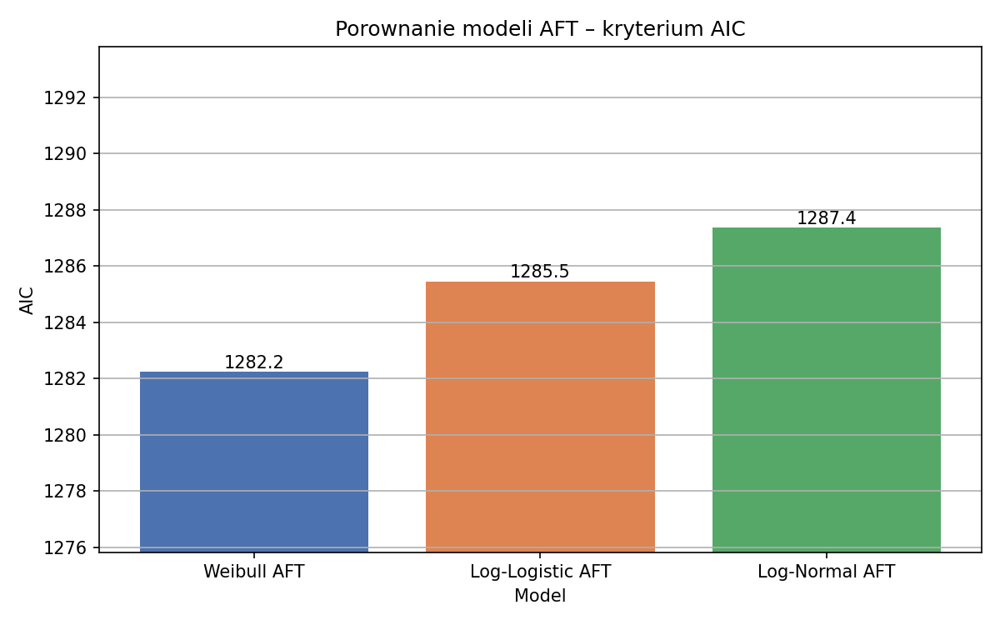

# Survival Analysis of Heart-Failure Patients

A complete **survival (time-to-event) analysis** on the heart-failure clinical
records dataset, covering the full methodological stack from non-parametric
estimators to parametric AFT models, a Bayesian extension, and a
semi-parametric Cox model with diagnostics.

`Python` · `lifelines` · `pandas` · `matplotlib` · survival analysis

> **Why this matters for analytics:** survival analysis is the rigorous way to
> model *time until an event* — in a product/fintech setting that is exactly
> **customer churn and retention** (time until a user goes inactive), with
> proper handling of censored (still-active) users.

## What's inside

- **Non-parametric** (`hf_modele_nieparametryczne.ipynb`) — Kaplan–Meier and
  Nelson–Aalen estimators, censoring structure, subgroup survival curves and
  log-rank tests.
- **Parametric AFT** (`hf_analiza_parametryczna.ipynb`) — Weibull / log-normal /
  log-logistic accelerated-failure-time models, **AIC-based model selection**,
  bootstrap confidence intervals for the median survival time, hazard and
  survival profiles, and a **Bayesian** posterior extension.
- **Semi-parametric** (`hf_model_semiparametryczny.ipynb`) — Cox proportional
  hazards model with proportional-hazards diagnostics.

## Selected outputs

Generated figures live in `Ready_models/` — e.g. AIC comparison across AFT
families, bootstrapped median survival, hazard profiles by covariate, and
censoring structure.




## Dataset

Heart Failure Clinical Records (public, 299 patients, 12 clinical features;
event = death during the follow-up period, with right-censoring).

## Run

```bash
pip install -r requirements.txt   # pandas, lifelines, matplotlib, ...
jupyter notebook Ready_models/hf_analiza_parametryczna.ipynb
```

*Course lecture slides and working notes are intentionally excluded from this repo.*
